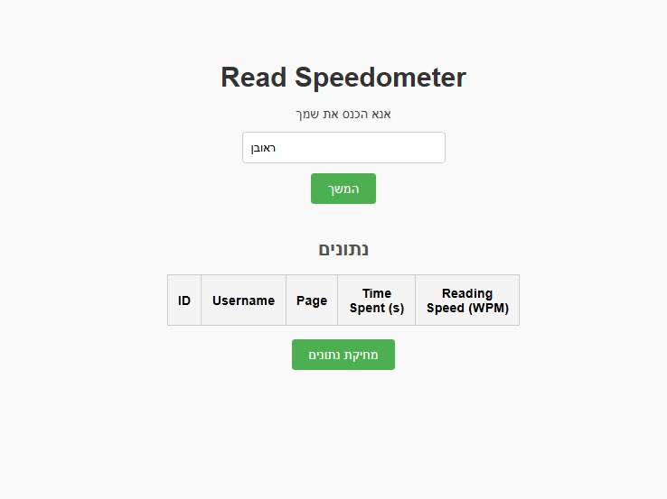
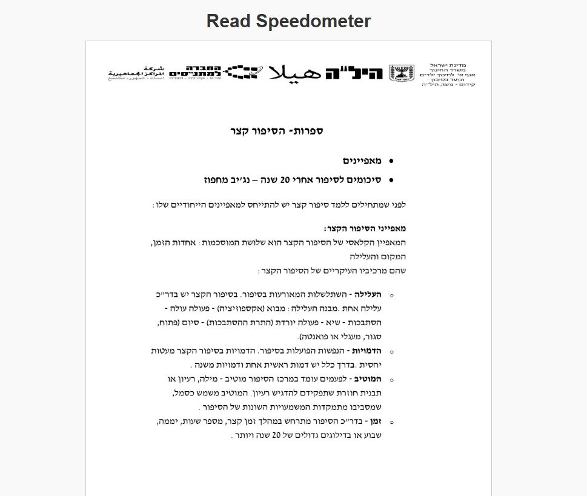
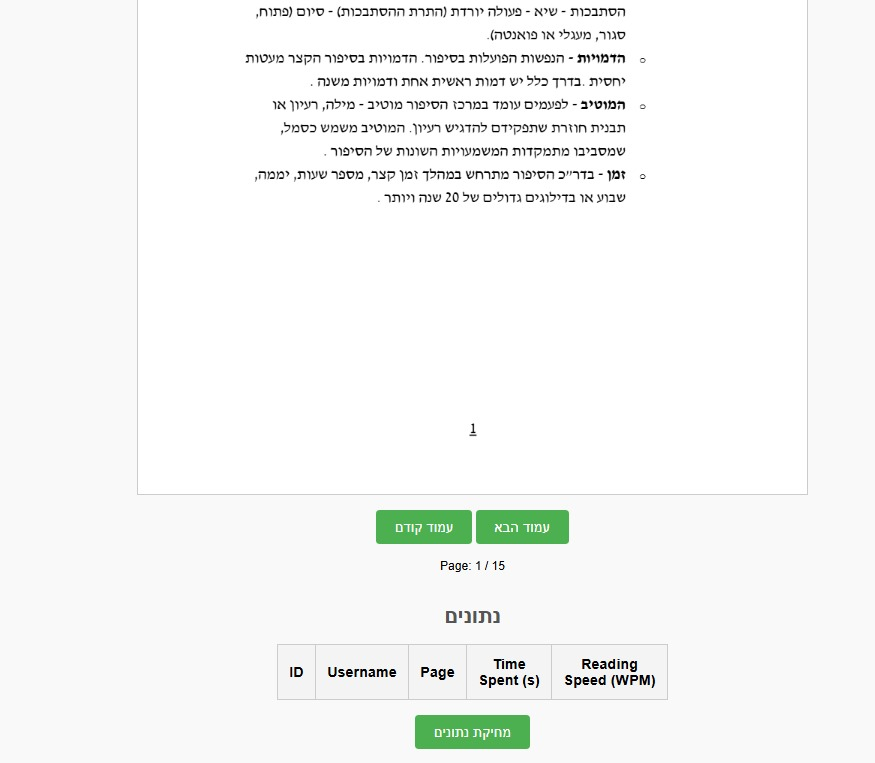
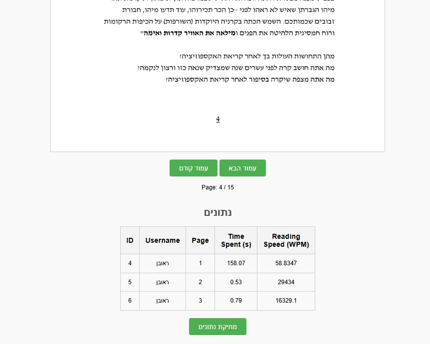
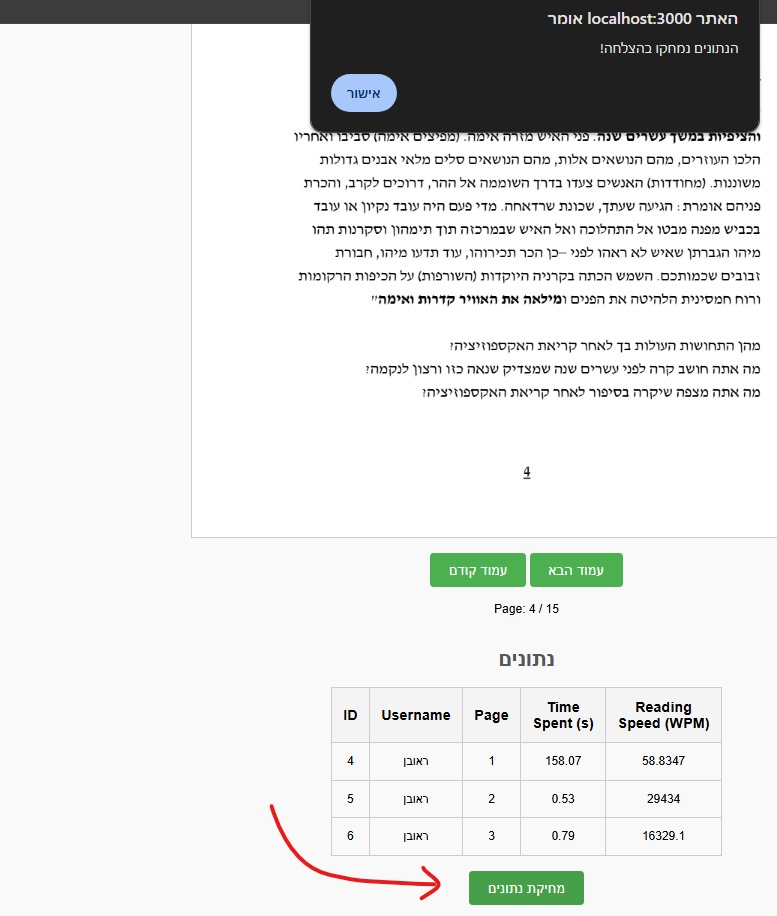
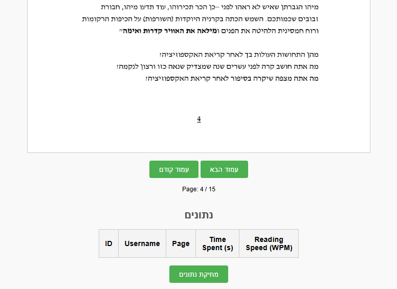

# Read Speedometer
Application for analyzing reading data and measuring reading speed in WPM (words per minutes).

# Project Structure
pycache
    database_interface.cpython-312.py
backend
    server.py
    DB_operations.py
    Dockerfile
    requirements.txt
frontend
    index.html
    app.js
    styles.css
    Dockerfile
    some_pdf.pdf
screenshots
    1_start_page.jpg
    2_typing_name.jpg
    3_PDF_view.jpg
    4_navigation_buttons,_data_table,_and_data_delete_button.jpg
    5_data_is_updated_in_the_table_after_browsing_forward.jpg
    6_data_deletion.jpg
    7_after_deletion.png
.env
docker-compose.yml
init.sql
README.md

# Instructions
1. Ensure you have Docker installed

2. Clone the Repository
git clone https://github.com/yourusername/read-speedometer.git

3. Go to project folder
cd read-speedometer

4. Build the application
docker-compose up --build -d

5. Open the browser and access the URL
http://localhost:3000

# Application Screenshots
### 1. Start Page

### 2. Typing Name

### 3. PDF View

### 4. Navigation Buttons, Data Table, and Data Delete Button

### 5. Data Update After Navigation

### 6. Data Deletion

### 7. After Data Deletion

